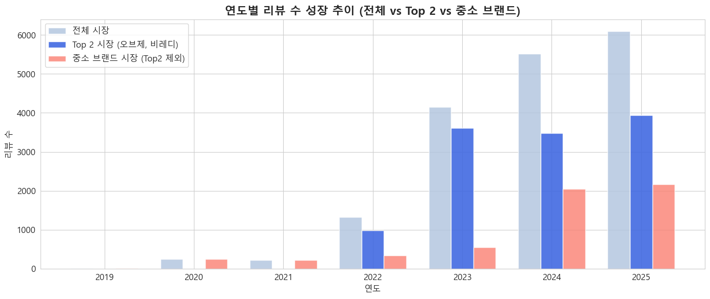

# 💄 남성 화장품 시장 분석 보고서

## 1. 프로젝트 개요 (Introduction)

> **"남자도 관리하는 시대"**
> 대한민국 남성들의 화장품 사용이 보편화되고 있습니다. 이제는 비비크림을 넘어 색조 화장까지 관심이 확장되고 있습니다. 하지만 여전히 많은 남성들은 오프라인 구매를 부끄러워하거나, 정보 부족으로 인해 어려움을 겪고 있습니다.
> 본 프로젝트는 남성 화장품 시장의 성장 원인을 분석하고, 이를 바탕으로 **초개인화 화장품 추천 알고리즘**을 개발하는 것을 목표로 합니다.

### 📊 브랜드별 리뷰 데이터 현황
주요 브랜드와 중소 브랜드 간의 리뷰 수 편차가 큼을 확인하였으며, 이를 기반으로 시장을 **Major 브랜드**와 **중소 브랜드**로 나누어 분석을 진행했습니다.

| 구분 | 브랜드명 | 리뷰 수 | 비고 |
| :--- | :--- | :--- | :--- |
| **Major** | **오브제** | **7,545** | 압도적 1위 |
| **Major** | **비레디** | **4,464** | |
| 중소 | 원오브뎀 | 1,161 | |
| 중소 | 그라펜 | 1,139 | |
| 중소 | 라끌랑 | 965 | |
| 중소 | 듀이셀 | 951 | |
| 중소 | 다슈 | 728 | |
| 기타 | 스웨거 | 261 | |
| 기타 | 두잉왓 | 215 | |
| 기타 | 정샘물 | 116 | |
| 기타 | 엠도씨 | 30 | |
| 전체 |       | 17,845 | |

---

## 2. 시장 분석 및 가설 검증

### 1-1. 남성 뷰티 시장의 성장 추세



*   **2022년~2023년**: 시장 성장기. 특히 2023년에 Major 브랜드(오브제, 비레디 등)의 리뷰 수가 폭발적으로 증가했습니다.
*   **2024년 이후**: Major 브랜드의 성장세는 다소 주춤한 반면, **중소 브랜드의 성장률**이 눈에 띄게 높아지고 있습니다.

### 1-2. 중소 브랜드 급성장의 원인


*   **신규 진입**: 2024년에만 5개의 새로운 중소 브랜드가 시장에 진입하며 전체 리뷰 수 증가를 견인했습니다.

### 1-3. 2024년 시장 정체와 마케팅의 상관관계


*   **반짝 상승 후 하락 패턴**: Major 브랜드들은 특정 시기에 판매량이 급증했다가 다시 원래 수준으로 회귀하는 패턴을 보입니다.
*   **인플루언서 마케팅 효과**:
    *   **오브제**: 덱스(DEX) 모델 발탁(23년 9월) 후 급성장 → 이후 하락.
    *   **비레디**: 유튜버 '스완' 공동개발 및 홍보 시점에 리뷰 증가 → 이후 하락.
    *   **4세대 쿠션 출시(24년 10월)**: 신제품 출시와 함께 리뷰 증가 → 다시 하락세.


*   **결론**: 인플루언서 언급 및 마케팅 시기와 리뷰 증가 시기가 정확히 일치합니다. 이는 남성 소비자들이 **홍보에 민감하게 반응**하여 구매하지만, 이것이 **지속적인 관심으로 이어지지 않음**을 시사합니다.

### 1-4. 문제점 도출 및 개선 방안


*   **다슈(DASHU)의 사례**: 중소 브랜드임에도 불구하고 릴스/숏츠 등 숏폼 콘텐츠를 활용한 활발한 홍보로 조회수와 관심도 등락이 큽니다. 영상을 보고 구매하는 소비자가 많음을 반증합니다.

#### 🚨 문제점
1.  **좁은 소비자층**: 뷰티에 이미 관심 있는 사람들에게만 노출됨.
2.  **낮은 지속성**: 홍보가 없으면 구매량이 급감함.

#### 💡 개선 방안: 타겟 확장 전략


*   **남성 특화 인플루언서 협업**: 뷰티 유튜버뿐만 아니라, 남성 시청 층이 두터운 게임(팡이요), 경제/시사(윤루카스) 등 타 분야 인플루언서와의 협업을 통해 **잠재 고객(Newbie)**을 유입시켜야 합니다.
*   **지속적인 숏폼 노출**: 다슈의 사례처럼 릴스, 숏츠를 통해 지속적인 노출을 유도하여 신규 유입을 늘려야 합니다.

---

## 3. 페르소나(Persona) 심층 분석

Gemini를 활용하여 리뷰 데이터를 분석, 4가지 핵심 페르소나를 도출했습니다.

1.  🎁 **Gifter (여성 구매자)**: 남자친구/지인 선물용
2.  🙋‍♂️ **User (일반 사용자)**: 본인 사용 목적
3.  👶 **Newbie (입문자)**: 화장을 처음 시작함
4.  👑 **Loyalist (숙련자)**: 원래 화장을 즐겨함

### 2-1. 입문자(Newbie) vs 숙련자(Loyalist) 니즈 비교


**Log-Odds Ratio** 분석을 통해 그룹별 특징적인 키워드를 도출했습니다.( **"A그룹과 B그룹에서 특정 단어가 등장할 확률이 얼마나 다른가?"**)

| 그룹 | 핵심 니즈 (Needs) | 선호 제품 특징 |
| :--- | :--- | :--- |
| **입문자 (Newbie)** | **편리함, 자연스러움**, 수염 자국 커버 | **올인원 스틱**, 브러쉬 일체형, 수정 화장이 필요 없는 제품 |
| **숙련자 (Loyalist)** | **성분, 신뢰도**, 디테일한 표현 | 브랜드 신뢰도, **피부 타입에 맞는 성분**, 정확한 톤 매칭 |

### 2-2. 선물하는 여성(Gifter)의 반응


*   보통 여성이 색상을 골라주기 때문에 **톤 매칭 실패 확률이 낮습니다.**
*   "자연스럽다", "커버력이 좋다", "피부톤에 맞다"는 긍정적 반응이 주를 이룹니다.

### 🎯 페르소나별 추천 전략
*   **입문자**: 톤로션, 올인원 스틱 등 스킬이 필요 없는 **'입문템'** 추천.
*   **숙련자**: 트러블 없는 **'순한 성분'**, 완벽한 커버를 위한 **'쿠션/파운데이션'** 추천.
*   **선물러**: 실패 없는 **'베스트셀러 세트'** 또는 **'올인원'** 제품 추천.

---

## 4. 부정 리뷰(Negative Review) 분석 및 제언

전체 리뷰 **17,845건** 중 부정 리뷰 **523건(2.9%)**을 정밀 분석했습니다.

### 3-1. 주요 불만 요인 (Executive Summary)

*   **1위 🎨 색상 미스매치 (22.9%)**: "너무 밝다", "회색빛이 돈다"
*   **2위 🧴 커버력 부족 (18.5%)**: "잡티가 안 가려진다"
*   **3위 🚨 피부 트러블 (14.9%)**: "여드름이 났다", "따갑다"

### 3-2. 제품별 개선 권고안

#### 🔴 최우선 개선 필요 (Critical)
*   **오브제 (내추럴 커버 파데)**: 색상 다양화 및 성분 개선 시급 (커버력 2.45/5).
*   **비레디 (블루 쿠션 4세대)**: 지속력 이슈 해결 및 고커버 라인업 추가 필요.

#### 🟠 우선 개선 대상 (Priority)
*   **다슈 / 라끌랑**: **지속력(1.5점)**이 매우 낮음. 무너짐 없는 포뮬러 개발 필수.
*   **비레디 (블루 파데)**: **커버력(1.0점)** 문제 심각. 전면 리뉴얼 필요.

### 3-3. 핵심 불만 키워드 (Log-Odds)
1.  **불만족** (+2.06)
2.  **유분기** (+1.56)
3.  **마스크 묻어남** (+1.50)

---

## 5. 전략적 제언 (Strategic Proposal)

### 🚀 단기 전략 (1~3개월)
*   **색상 가이드 강화**: 온라인에서도 실패 없는 호수 선택을 위한 가이드/앱 서비스 도입.
*   **CS 강화**: 부정 리뷰 고객 대상 무료 교환 등 케어 프로그램 운영.

### 🚀 중장기 전략 (6개월~)
*   **R&D 투자**: 다슈/라끌랑 등 지속력 문제 해결을 위한 포뮬러 개발.
*   **라인업 세분화**: 민감성 피부 전용(저자극), 지성 전용(매트) 등 피부 타입별 라인업 구축.

---

## [부록] 초보자를 위한 유튜버 추천 가이드

남성 뷰티 입문자들을 위한 맞춤형 유튜버 추천 리스트입니다.

| 대상 | 추천 유튜버 | 특징 |
| :--- | :--- | :--- |
| **완전 초보** |   | **기초 케어부터 메이크업까지.** 스킨케어 기본기 교육. |
| **관리족** |  | **성분 분석 전문가.** 피부 타입별 과학적 제품 추천. |
| **운동하는 남자** |  | 식단과 성분을 고려한 **헬스인 맞춤형** 추천. |

---

## 🔗 추천 시스템 체험하기

**남성 화장품 맞춤형 추천 시스템**을 직접 체험해보세요!

👉 **[https://mans-beauty.vercel.app/](https://mans-beauty.vercel.app/)**

---

## 📂 프로젝트 구조

```
프로젝트 루트/
├── code/
│   ├── 1_data_collection/        # 데이터 수집
│   ├── 2_data_preprocessing/     # 데이터 전처리
│   ├── 3_analysis/               # 데이터 분석
│   ├── 4_visualization/          # 시각화
│   └── 5_recommendation_system/  # 추천 시스템
├── data/                         # 데이터 파일
├── docs/                         # 문서
├── images/                       # 분석 보고서 이미지
└── outputs/                      # 출력 결과
```

---

## 🛠️ 기술 스택

- **데이터 수집**: Selenium, BeautifulSoup
- **데이터 분석**: Pandas, NumPy, Scikit-learn
- **자연어 처리**: Google Gemini API, KoNLPy
- **시각화**: Matplotlib, Seaborn, Plotly
- **추천 시스템**: Content-based Filtering
- **대시보드**: Streamlit

---

## 👥 팀원

- **문효준** - 프로젝트 리더, 데이터 분석 및 시각화

---

## 📄 라이선스

이 프로젝트는 교육 목적으로 제작되었습니다.

---

**최종 업데이트**: 2026-01-30
